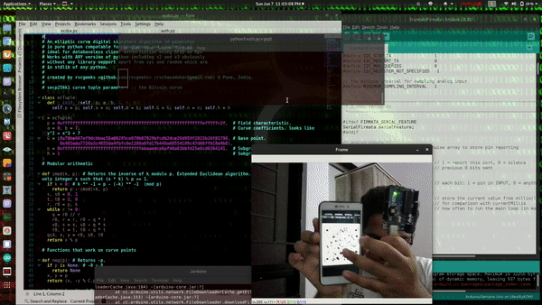

# Rvc ECDSA QR Id generator and verifier

An ECDSA (elliptic curve digital signature algorithm) QR code id generator
and verifier using camera with arduino firmata support 
in pure python compatable for beaglebone and raspberry pi.
ideal for databaseless authorisation using camera on Rpi.
The secp256k1 (Bitcoin Curve) is used for ECDSA here



## Features

1) Supports on Raspberry Pi as well as webcam on PC
2) Can connect arduino for servo control for door lock or barrier boom
3) Fast and live capture of QR ID
4) Gruoping of Ids supported

## Getting Started

These instructions will get you a copy of the project up and running on your local machine for development and testing purposes. See deployment for notes on how to deploy the project on a live system.

### Prerequisites

This application was tested on Kali Linux 2019.3

1) opencv-python (for camera interface)
2) pyzbar (for decoding QR codes from video)
3) qrcode (for creating GR code into image)
4) if arduino support, pyfirmata library and arduino board with atleast 2 LEDs

Remember that pyzbar needs zbar package on your system (libzbar)
To install the requirements one can run,
```
pip install -r requirements.txt
```
with super user privileges 

## Deployment

The following steps will guide you setting up the libraries and launching the Id generator.

A) Generation

This ID generators supports authorisation for a group 
Here all the signatures of the members in the same group are generated
from the same private key generated for that specific group.
Each group's private key is stored in 'keys' directory named after the
group name. An Id in specific group can only be verified by the private key
of that particular group.

the syntax to create the signs for a specific group is
```
python auth.py s [group name] [numsigns]
```
where 'numsigns' is optional which specifies No. of Ids or signatures to be generated

For creating 10 signature for say 'grp1', 15 signatures of 'grp2' and 20 signatures of 'grp3',
run commands
```
python auth.py s grp1 10
python auth.py s grp2 15
python auth.py s grp3 20
```

This will save the respective QR Ids in png images format in 'credentials'
directory named 'cred_(group name)_(sign no.).png'

These images can be shared to the authorised people so if they come to your 
event they can produce that image in front of your camera to verify.

B) Verification

One must remember that Verification can be done for a specific group prescribed in commandline arguments

If one wants arduino support, one must program the arduino by Firmata by
arduino IDE -> File -> Examples -> Firmata -> StandardFirmata and upload to arduino board
and in 'auth.py' from line 100 modify the code and actuators connected to your arduino board.

To start the verifier for a particular group the syntax is:
```
python auth.py v [group name]
```
so to scan and verify the Id for grp1, run
```
python auth.py v grp1
```
This will initialise the arduino (if connected) and launch the webcam video window
after this one can produce the generated QR Id image in front of camera and on 
success terminal shows 'VERIFIED OK' else 'NOT AUTHORISED'
and arduino does the dedicated task of unlocking or locking the door if programmed in auth.py accordingly

## Author

* **Rajas Chavadekar** 

## License

This project is licensed under the MIT License - see the [LICENSE](LICENSE) file for details

